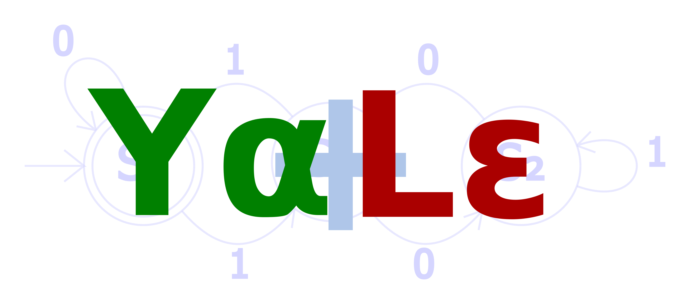

# YaLe

YaLe is Yet another Lexer eliminator, or Yacc and Lex combined. It may also
mean YaLe ain't Lexing engine. It is intended for event-driven incremental
non-blocking network protocol parsing in a state machine architecture.
Essentially, you have a parser state for each connection. When new data
arrives, you feed it to the parser.

The ingenuity of YaLe is parser state dependent lexer. The lexer is fully
integrated to the parser, and generated at the same time the parser is
generated, explaining the name of YaLe. There is an internal architecture that
separates lexing and parsing to different functions, but as explained, the
state machine the lexer uses is dependent on the parser state.

# Technical details

YaLe was originally implemented in Python. Either a recent version of Python 2
or a Python 3 worked. However, this Python-based implementation was changed to
be fully C-based. For the Python implementation and for the C implementation,
parsers are created with a domain specific language. The Python interface is
not intended to be used directly. The Python implementation is currently
unsupported, and very likely contains lots of unfixed bugs.

YaLe uses a deterministic state machine, parser state dependent, to implement
maximal munch tokenizing. Backtracking is supported for cases where there may
be a transition from an accepting state to a non-accepting state and again to
an accepting state, but the maximum backtracking amount must be bounded. The
backtrack buffer is statically allocated. For two tokens that can have the same
length, maximal munch is complemented by a priority-based scheme where every
token can have a priority.

Parsing is LL(1) with an additional restriction that the grammar must not be
infinitely recursive. The parser stack is statically allocated, due to grammar
not being infinitely recursive. These restrictions mean languages like
programming languages and mathematical expression languages cannot be parsed
even if the grammar conversion to LL(1) is manageable. However, for network
protocols, typically the grammar is extremely simple with no infinite
recursion, and the main difficulty lies in the parser state dependent lexer
that YaLe successfully implements.

A number of object types is limited to at most close to 256 items of the given
type (few last numbers may be reseved for special purposes). The reason is that
many integers are limited to 8 bits for space reasons.

Callbacks and actions are supported. Actions are executed when the parser
reaches a given state. Callbacks are executed when lexing. The callback system
is particularly sophisticated, but may do mistakes in some cases due to
imperfect information. Note a perfect callback system cannot exist due to the
possibility to have imperfect information about the future characters to be
read.

# Why LL(1) and not LALR?

A reader familiar with parsing technology might ask why LL(1) is used instead
of LALR.

Originally, the reason was that LL(1) is simpler to implement for the parser
generator author, and LL(1) generates smaller parsers. The benefits of LALR can
be seen when parsing computer languages where a number of expression types can
start with the same token. LL(1) parser will require the conversion of the
grammar to a form that doesn't have multiple alternatives starting with the
same token, whereas LALR requires no such modifications. However, YaLe is not
concerned with computer language parsing, because it is concerned only with
network protocol parsing. Network protocols can easily be parsed with a LL(1)
parser with a parser state dependent lexer.

Later on, it was actually realized that a streaming incremental callback system
cannot be easily implemented for LALR parsers because LALR parsers do not have
full information about the context, as they deduce it when seeing symbols on
the go. However, LL(1) may easily support a streaming incremental callback
system.

# Performance

YaLe parses HTTP headers at a rate of 3.1 gigabits per seconds on a modern
computer, using a single thread. Different threads can parse concurrently
different connections, so it won't take many connections to reach line rate.
Note also that HTTP body does not require as much parsing as HTTP headers, if
implementing deep packet inspection for the full HTTP data stream.

The Python version of YaLe generated the HTTP parser in about 0.1 seconds. The
exact time taken depends on the version of Python used (Python 2 being faster
than Python 3). However, both Python 2 and Python 3 generate equivalent parsers
with equivalent parsing-time performance. Note that currently, the Python
version of YaLe is unsupported. The C version generates a parser in few
milliseconds.
